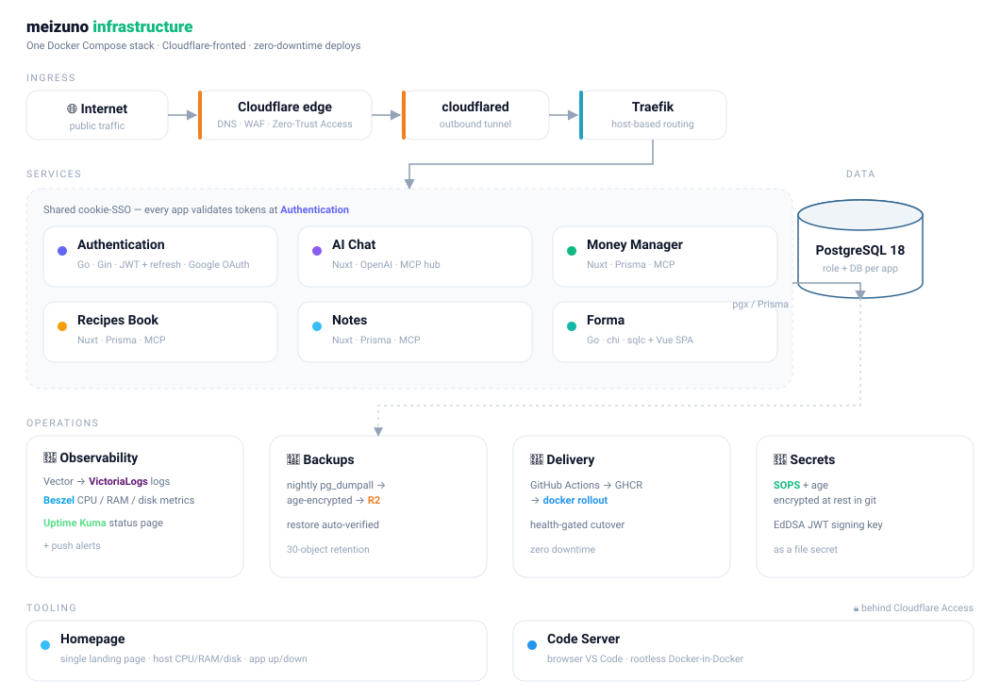
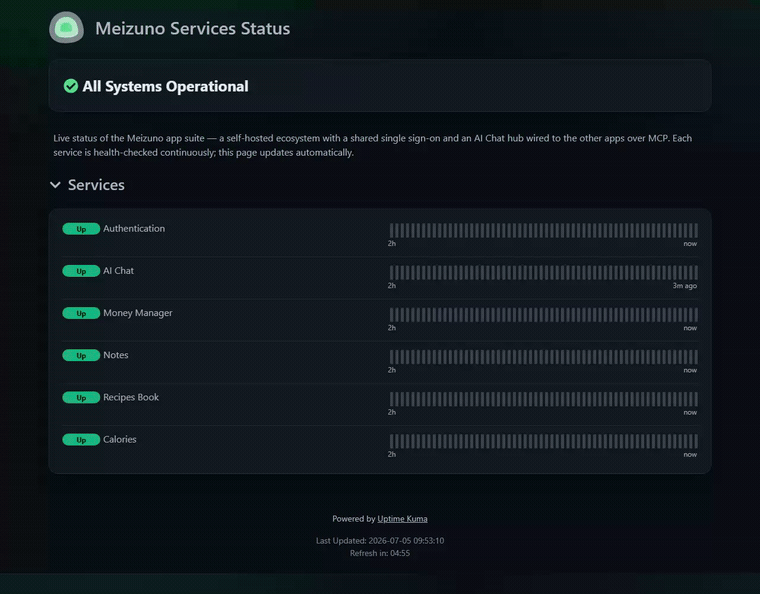
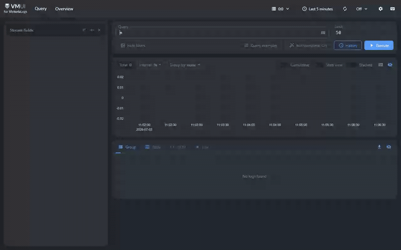
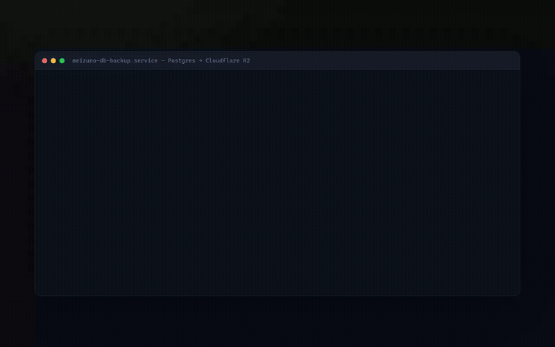

# Infrastructure

A single Docker Compose stack that runs the whole **meizuno** ecosystem behind
**Traefik** and a **Cloudflare Tunnel**, with **zero-downtime deploys** at one
replica per service.

<p align="center">
  
</p>

## In action

<sub>Recorded against the stack running locally.</sub>

#### 📊 Status page — Uptime Kuma, all systems operational

<a href="https://status.meizuno.com/status/meizuno"></a>

<sub>Every service checked on a 20s interval. Live page: <a href="https://status.meizuno.com/status/meizuno">status.meizuno.com ↗</a></sub>

#### 🔭 Centralized logs — Vector → VictoriaLogs, queried with LogsQL



#### 💾 Backups — nightly pg_dumpall → age-encrypted → R2, restore auto-verified



> <sub>Full-resolution MP4s: <a href="preview/status.mp4">status</a> · <a href="preview/logs.mp4">logs</a> · <a href="preview/backup.mp4">backup</a>.</sub>

## How it works

- **Two files, one project.** `compose.yaml` is a thin `include:` of
  `compose.infra.yaml` (ingress, data, monitoring, logs) and
  `compose.apps.yaml` (the application services). They merge into a single
  `meizuno` project, so `docker compose` / `docker rollout` / `deploy.sh` all
  operate on the whole stack — the split is for readability, not isolation.
- **No host ports.** `cloudflared` reaches Traefik over the `edge` docker
  network, so nothing is published on the VM. The only way in is the tunnel.
- **Traefik** is the single reverse proxy. Each app declares its hostname in
  labels (`Host(\`chat.meizuno.com\`)`), so routing lives in this repo — not in
  the Cloudflare dashboard.
- **TLS** is terminated by Cloudflare. Traefik speaks plain HTTP on `:80`; there
  is no ACME/Let's Encrypt to manage.
- **Three networks:** `edge` (cloudflared ↔ traefik ↔ apps), `internal`
  (apps ↔ postgres, never reachable from edge), and `logs` (vector ↔
  victoria-logs).
- **Centralized logs.** Vector tails every container via the Docker socket and
  ships to VictoriaLogs (30-day retention). The log UI is at
  `logs.meizuno.com` behind Cloudflare Access (Zero Trust), like the Traefik
  dashboard — neither service has built-in auth, so the tunnel + Access is the gate.
- **One Postgres, one role per app.** Each app owns ONLY its own database and
  can CONNECT only to it (`auth_user`→`authentication`, `money_user`→
  `money_manager`, `recipes_user`→`recipes_book`, `notes_user`→`notes`), each
  with its own password. A leaked app password is confined to that app's data —
  it can't read, write, or drop another app's schema. ai-chat is stateless and
  owns no database.

## Zero-downtime with one replica

Plain `docker compose up` stops the old container before starting the new one.
To get zero downtime while keeping a single steady-state replica, deploys use
[`docker-rollout`](https://github.com/wowu/docker-rollout): it transiently scales
a service to **2**, waits for the new container to become **healthy**, then
removes the old one. Traefik load-balances across both during the swap.

This is why the five app services **must not** set `container_name:` or `ports:`
— both would break transient scaling. Infra services (traefik, cloudflared,
postgres, kuma, victoria-logs, vector) are not rolled and keep their fixed
names — Vector relies on the exact `vector`/`victoria-logs` names to exclude its
own logs.

> Requires each app image to define a `HEALTHCHECK` (the meizuno images do) so
> rollout knows when the new container is ready.

## Setup

```bash
# 1. Prereqs (Docker + Compose v2 already installed on the host)
./scripts/install-prereqs.sh        # installs the docker-rollout plugin

# 2. Config
cp .env.example .env                 # fill in every value
cp config/ai-chat.yml.example config/ai-chat.yml

# 3. First boot
docker compose up -d                 # infra + apps
docker compose ps
```

The Traefik dashboard and the logs UI have no built-in auth — gate them at the
edge with **Cloudflare Access** (Zero Trust) on `traefik.<domain>` and
`logs.<domain>`, the same way the other dashboards are protected.

### Cloudflare dashboard (token-mode tunnel)

In **Zero Trust → Networks → Tunnels → your tunnel → Public Hostnames**, point
**every** hostname at the proxy (Traefik discovers `cloudflared` on the `edge`
network by service name):

| Hostname               | Service              |
|------------------------|----------------------|
| `chat.meizuno.com`     | `http://traefik:80`  |
| `money.meizuno.com`    | `http://traefik:80`  |
| `recipes.meizuno.com`  | `http://traefik:80`  |
| `notes.meizuno.com`    | `http://traefik:80`  |
| `auth.meizuno.com`     | `http://traefik:80`  |
| `status.meizuno.com`   | `http://traefik:80`  |
| `traefik.meizuno.com`  | `http://traefik:80`  |
| `logs.meizuno.com`     | `http://traefik:80`  |
| `beszel.meizuno.com`   | `http://traefik:80`  |

Traefik then dispatches each Host to the right container. Put the tunnel token
in `CLOUDFLARE_TUNNEL_TOKEN`.

## Deploy

```bash
./scripts/deploy.sh                  # pull + zero-downtime rollout of all apps
./scripts/deploy.sh ai-chat          # just one service
```

Wire this into each app's CI as the last step (SSH to the host, then
`./scripts/deploy.sh <service>`), replacing the old per-app `compose up -d`.

## Rollback

Images are tagged by commit SHA in GHCR. To roll back, pin the tag and roll out:

```bash
# pin in .env or override the image, then:
docker compose pull ai-chat && docker rollout ai-chat
```

## Backups (Postgres → Cloudflare R2)

`scripts/backup-db.sh` runs `pg_dumpall` (roles + every database) inside the
running `postgres` container, gzips it, **encrypts it client-side with age**, and
uploads it off-host to **Cloudflare R2** via a throwaway `amazon/aws-cli`
container. R2 only ever stores ciphertext, so a leaked R2 token cannot read the
data or the role password hashes. The dump is encrypted in the pipe — plaintext
never touches disk. The age recipient defaults to the host SOPS age key (override
with `BACKUP_AGE_RECIPIENT`). Set `KUMA_PUSH_URL` to an Uptime-Kuma push monitor
and the run pings it up/down, so a failed **or never-run** backup alerts.

**Setup (once):**
1. Create an R2 bucket and an R2 **API token** (Object Read & Write) → it gives
   an Access Key ID / Secret Access Key and an endpoint
   `https://<account-id>.r2.cloudflarestorage.com`.
2. Fill `R2_ENDPOINT`, `R2_BUCKET`, `R2_ACCESS_KEY_ID`, `R2_SECRET_ACCESS_KEY`
   (and optional `R2_PREFIX`) in `.env`.
3. Install the daily timer:
   ```bash
   sudo cp systemd/meizuno-db-backup.{service,timer} /etc/systemd/system/
   sudo systemctl daemon-reload
   sudo systemctl enable --now meizuno-db-backup.timer
   systemctl list-timers meizuno-db-backup.timer     # confirm next run
   ./scripts/backup-db.sh                             # one manual run to verify
   ```
   (Adjust `WorkingDirectory`/`ExecStart` paths in the unit if your stack dir
   differs from `/home/debian/servers/meizuno`.)

**Retention:** set an R2 **lifecycle rule** on the bucket (e.g. delete objects
older than 30 days) — simpler and safer than pruning from the box.

**Restore** (into a fresh/empty Postgres) — decrypt with the age key first:
```bash
aws s3 cp s3://$R2_BUCKET/postgres/<file>.sql.gz.age - --endpoint-url $R2_ENDPOINT \
  | age -d -i ~/.config/sops/age/keys.txt | gunzip \
  | docker compose exec -T postgres psql -U admin -d postgres
```
(Losing the age key means the backups are unrecoverable — keep it backed up, the
same key that decrypts `secrets.enc.env`.)

**Verify the backup restores** (a backup you've never restored isn't a backup).
`scripts/verify-restore.sh` pulls the newest dump (or a key you pass), restores
it into a **throwaway** Postgres container (never the live DB), and prints the
databases, roles, and per-DB table/row counts so you can eyeball that the data
is really there. The temp container is removed on exit. Run it after first
setup and periodically:
```bash
./scripts/verify-restore.sh
```

## Server metrics (Beszel)

`beszel` (hub UI + store) and `beszel-agent` track **CPU, RAM and disk** of the
host, plus per-container stats and network I/O. UI at `beszel.meizuno.com`
(Beszel's own login; add a Cloudflare Access app in front for an extra gate).

The agent talks to the hub over a **shared unix socket** (`beszel-socket`
volume) — no network port is exposed. Host disk comes from a read-only
bind-mount of `/` (`FILESYSTEM=/host`); CPU/RAM from the shared kernel;
`network_mode: host` gives real NIC stats.

**Setup (once):**
1. Add the `beszel.meizuno.com` hostname to the tunnel in the Cloudflare
   dashboard (→ `http://traefik:80`), like the other UIs.
2. Deploy the hub: `./scripts/deploy.sh` (or `docker compose up -d beszel`).
3. Open `beszel.meizuno.com`, create the admin account, then **Add System**:
   set **Host / IP** to `/beszel_socket/beszel.sock` (leave the port blank) and
   save. The dialog shows the agent's `KEY` and `TOKEN`.
4. Put them in secrets — `BESZEL_KEY` (the hub's public key) and `BESZEL_TOKEN`
   — via `./scripts/secrets.sh` (or `.env`).
5. Deploy the agent: `./scripts/deploy.sh beszel-agent`. It connects over the
   socket within ~15s and the system goes green. (Until `KEY`/`TOKEN` are set the
   agent just sits unconnected — harmless.)

To also chart extra mounts (a data disk, etc.), add `EXTRA_FILESYSTEMS` to the
agent with the matching mount bound in.

## Token signing (EdDSA)

The auth service signs access tokens with **EdDSA** (Ed25519, asymmetric). The
**private** signing key lives only on the host as a file secret mounted into the
`authentication` container — never an env value, never in `docker inspect`, never
in git. The **public** half is published at `auth.meizuno.com/.well-known/jwks.json`.

Consumers (notes, money-manager, recipes-book, ai-chat) **do not hold any signing
key** — they validate every request against the auth service's `/validate`
endpoint. So signing changes are an auth-service-only concern: no app changes, no
app redeploys.

**First-time setup:**
```bash
./scripts/gen-jwt-key.sh             # writes secrets/jwt_private_key.pem
docker compose up -d authentication  # or ./scripts/deploy.sh authentication
curl -s https://auth.meizuno.com/.well-known/jwks.json   # shows the public key
```

> The key file is written `0644` inside a `0700 secrets/` dir on purpose: docker
> bind-mounts it into the authentication container, which runs as a non-root uid,
> and non-Swarm compose does not remap secret ownership — a `0600` file owned by
> the host user gives the container "permission denied". The `0700` directory
> still blocks other host users, so protection is equivalent.

**Cutover from the legacy HS256 secret** (zero downtime; the auth service accepts
both during the window because `JWT_SECRET` is still set):
1. Generate the key and deploy with EdDSA (above). New tokens are EdDSA; the
   in-flight HS256 access tokens (≤15 min TTL) still validate.
2. Wait > 15 minutes — every HS256 access token has now expired. Refresh tokens
   are opaque (DB-hashed), so they are unaffected.
3. **Blank `JWT_SECRET=`** in `.env` and redeploy `authentication`. HS256 is now
   rejected outright; only EdDSA is accepted. This also retires the old shared
   secret (a de-facto signing-key rotation).

**Rotating the signing key (seamless, zero failed validations):** the auth
service can verify against several keys by `kid`, so a rotation overlaps the old
and new key for one access-token TTL:
```bash
./scripts/rotate-jwt-key.sh             # keep old public key, mint a new signer
./scripts/deploy.sh authentication      # signs with the new key; still accepts old
# … wait > 15 min (in-flight old-key tokens expire) …
./scripts/rotate-jwt-key.sh --finalize  # drop the old key
./scripts/deploy.sh authentication
```
During the overlap both public keys are published at `/.well-known/jwks.json`.
The old **private** key is discarded immediately on rotation — only its public
half is kept, and only to verify already-issued tokens.

## Secrets at rest (SOPS + age)

Secrets can be kept **encrypted at rest** with [SOPS](https://github.com/getsops/sops)
+ [age], so the canonical secrets file is safe to commit and safe in host
snapshots/backups — only values are encrypted, keys stay readable for diffs.

- `secrets.enc.env` — canonical, **committed**, values encrypted.
- `.env` — derived, **gitignored**, `0600`, what docker compose actually reads.
  `deploy.sh` regenerates it from `secrets.enc.env` on every deploy.
- The age **private** key (`~/.config/sops/age/keys.txt`) never leaves the host
  and is the only thing that can decrypt. **Back it up** — losing it loses the
  secrets.

```bash
# one-time: install sops + age, then
./scripts/secrets.sh init       # make an age key, write .sops.yaml, encrypt .env
git add secrets.enc.env .sops.yaml && git commit -m "chore: encrypt secrets"

./scripts/secrets.sh edit       # change a secret (re-encrypts on save)
./scripts/secrets.sh decrypt    # materialize .env by hand (deploy does this too)
```

Stronger variant (no plaintext `.env` on disk at all): wrap commands in
`sops exec-env secrets.enc.env 'docker compose up -d'`. This needs the age key
available non-interactively (`SOPS_AGE_KEY_FILE`) for the systemd backup unit,
so the simpler 0600-`.env` flow above is the default.

[age]: https://github.com/FiloSottile/age

## Notes & caveats

- **Hostnames are assumptions** (`chat/money/recipes/notes/auth/status.meizuno.com`).
  Adjust the `Host(...)` labels and the dashboard table to match your real DNS.
- `postgres/init/01-init.sh` (per-app roles + databases) runs **only on a fresh
  volume**. On an **existing** volume it won't run — to move off the old shared
  `web` role to per-app roles, run `scripts/migrate-db-roles.sh` once (after
  `git pull`, before redeploying the apps): it creates each role, transfers
  database + object ownership, and confines CONNECT. Then redeploy the apps and
  `DROP ROLE web`.
- App schema migrations still run from each app's own image/entrypoint
  (e.g. Notes runs `prisma migrate deploy` on start).
- Kuma keeps `container_name:` and is not rolled.
